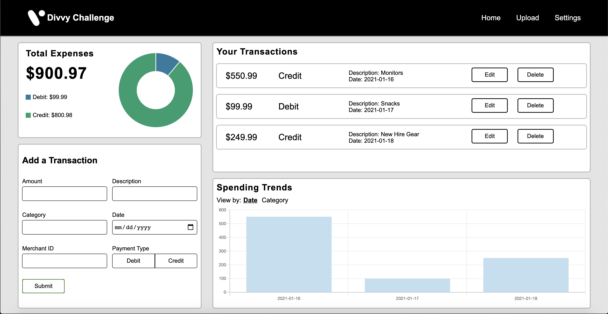
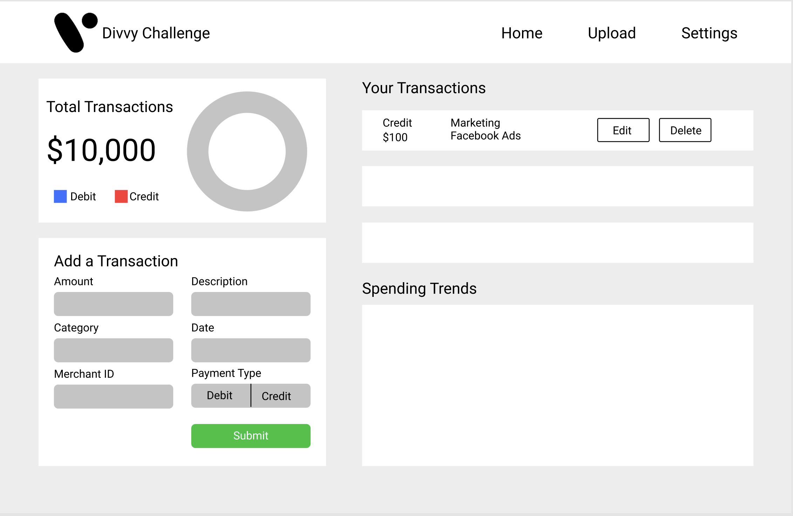

# Divvy Homework Assignment

Welcome to my submission to the Divvy Homework Assignment. This application allows users to get, add, update, and delete transactions, upload transactions through a csv file, and view total expenses and spending trends through a histogram and doughnut chart. The objectives that I completed are:

* Write a basic user interface that allows users to enter, edit, and remove transaction
* Provide a pie chart or histogram of the spend per category or spend per day, respectively
* Seed the database
* Add a user experience that showcases your abilities on the front end (focused on better navigation, improved styling, multiple routes with content)
* Create a user setting that can convert displayed numbers to roman numerals (attempted, working version found in Settings.js)

Take a peek at what the project looks like:

## Testing

Examples of Jest tests and React component tests can be found in the webapp/src/__tests__ directory. I provided a couple examples of each to demonstrate my ability.

## Planning

Before attempting the challenge, I went through planning what I needed to research and what I wanted the project to look like. Things I researched include:

* MongoDB (no prior experience with Mongo before, and I LOVED it)
* uuidv4 to add identifiers on transaction documents
* Uploading CSV files to seed the MongoDB graphql DB
* Emotion-js (love how similar it is to styled-components)

Provided below is the basic wireframe I started with (some adjustments can be seen in the final product, especially regarding the color scheme):

## Concluding Thoughts

This project was a blast. I felt like I got to showcase what I know while also showcasing how effectively I learn new things. Thank you for your time, and I hope you enjoy the code!
